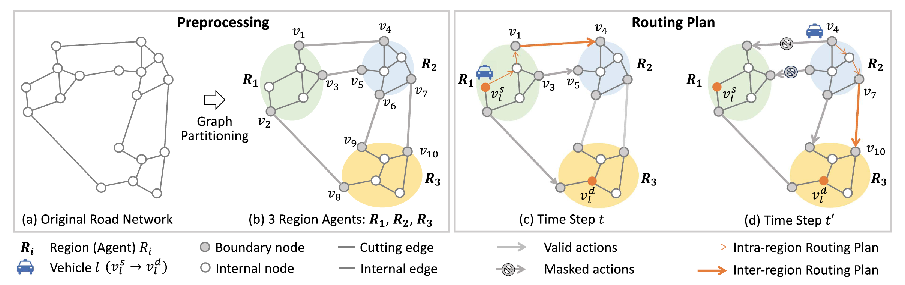

# asynMARL
This repository contains the official PyTorch implementation of the paper:

> **Cooperative Path Planning With Asynchronous Multiagent Reinforcement Learning**
> *TMC, 2025*
> https://ieeexplore.ieee.org/abstract/document/10833653
---

## Overview

As the number of vehicles grows in urban cities, planning vehicle routes to avoid congestion and decrease commuting time is important. In this paper, we study the shortest path problem (SPP) with multiple source-destination pairs, namely MSD-SPP, to minimize the average travel time of all routing paths. The asynchronous setting in MSD-SPP, i.e., vehicles may not simultaneously complete routing actions, makes it challenging for cooperative route planning among multiple agents and leads to ineffective route planning. To tackle this issue, in this paper, we propose a two-stage framework of inter-region and intra-region route planning by dividing an entire road network into multiple sub-graph regions. Next, the proposed asyn-MARL model allows efficient asynchronous multi-agent learning by three key techniques. First, the model adopts a low-dimensional global state to implicitly represent the high-dimensional joint observations and actions of multi-agents. Second, by a novel trajectory collection mechanism, the model can decrease the redundancy in training trajectories. Additionally, with a novel actor network, the model facilitates the cooperation among vehicles towards the same or close destinations, and a reachability graph can prevent infinite loops in routing paths. On both synthetic and real road networks, the evaluation result demonstrates that asyn-MARL outperforms state-of-the-art planning approaches.


---

## Installation

Requirements:
- Python 3.8.8
- SUMO 1.8.0
- traci 1.14.1
- Pytorch 1.11.0 + cuda 11.3

## Training & Evaluation
### Train and Evaluate on Synthetic dataset
```bash
python main.py --experiment_name 03-2-1000-2 --algorithm_name mappo-qr --route_files 'environment/networks/2x2x25/trips_biased_demand_03_2.xml' --max_vehicle_num 150 --road_capacity_limit 10 --demand_scale 2 --max_travel_time 1000 --seed 1 --use_centralized_V --use_dag --use_query_rnn --use_feature_normalization --num_env_steps 240000
```
